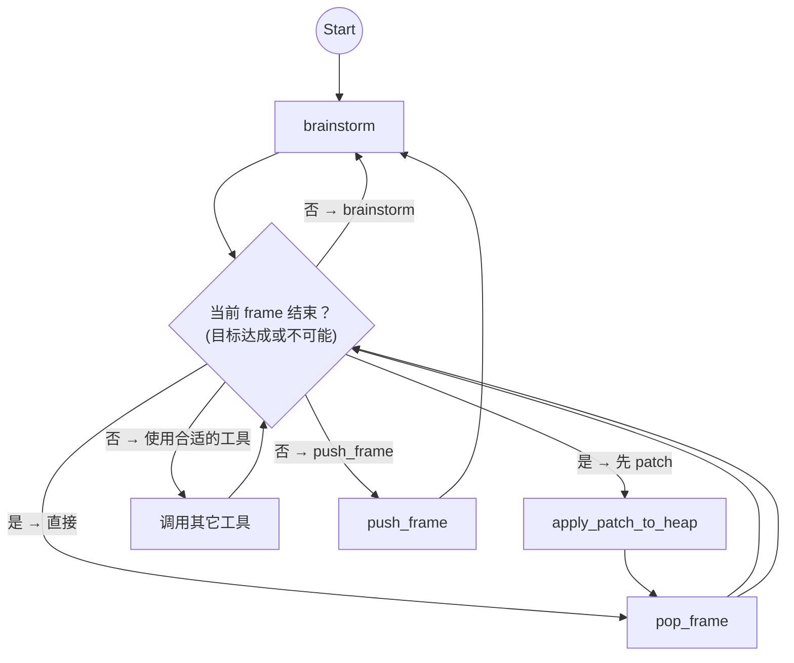

```mermaid
flowchart TD
  Start((Start)) --> B[brainstorm]
  B --> D{"当前 frame 结束？\n(目标达成或不可能)"}

  %% 结束路径（二选一）
  D -->|"是 → 直接"| Pop[pop_frame] --> D
  D -->|"是 → 先 patch"| Patch[apply_patch_to_heap] --> Pop --> D

  %% 未结束路径（三选一；不含 patch）
  D -->|"否 → brainstorm"| B
  D -->|"否 → 使用合适的工具"| Tools[调用其它工具] --> D
  D -->|"否 → push_frame"| Push[push_frame] --> B
```